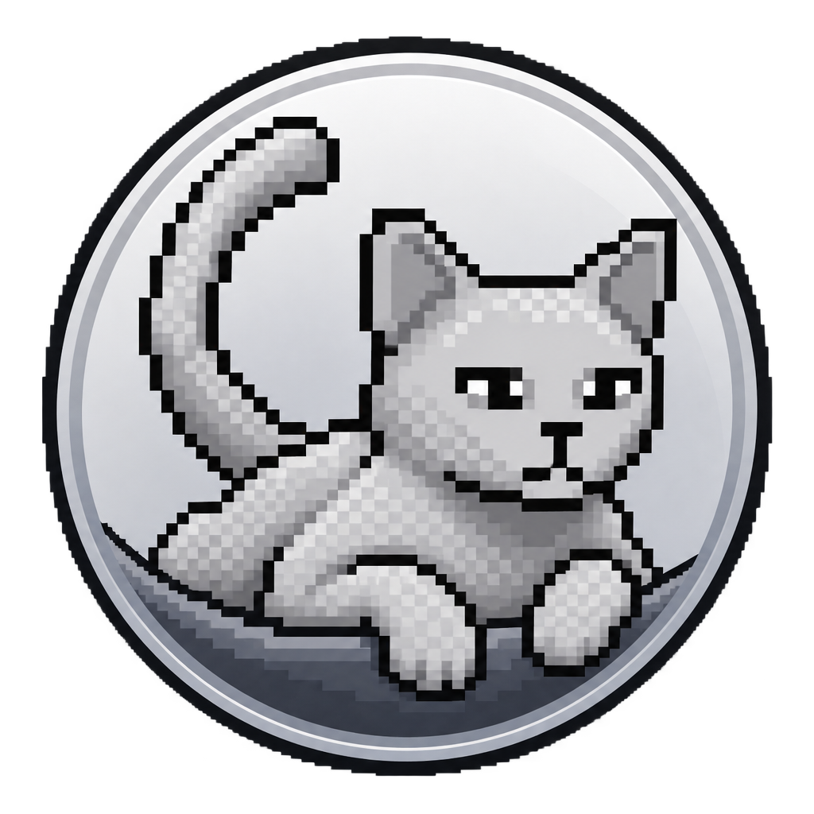
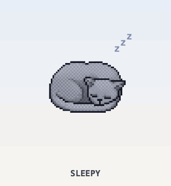
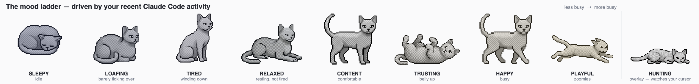
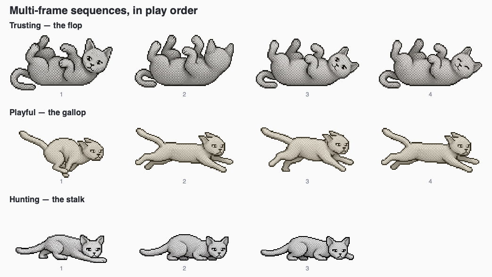

<div align="center">



# Meowsage

**your AI coding activity, as a cat**

[](https://github.com/kalkal87/meowsage/actions/workflows/tests.yml)

</div>

A pixel-art cat that lives on your desktop and reacts to how hard you're
working — in Claude Code, Codex, or both. Busy afternoon, and it's tearing
around the screen. Quiet one, and it's asleep in the corner.

<div align="center">



</div>



It reads your own Claude Code and/or Codex session logs (whichever it finds
installed), so it needs no account, no network access and no API key. Nothing
leaves your machine.

---

## The interesting part: it grades you against yourself

The obvious way to build this is to compare your token usage against a plan
limit. That was rejected early, because it produces a pet that is miserable for
most people most of the time — and one that breaks the moment Anthropic changes
a number.

Instead the cat compares your **last 60 seconds** against **your own last
hour**. It buckets the past hour of activity by the minute, throws away the
idle minutes, and asks where the current minute lands in that distribution.
Above your recent 75th percentile is `HAPPY`; above the 90th is `PLAYFUL`.

That makes the signal self-normalising. A heavy user and a light user both see
the full range of moods, because "busy" is defined per person and re-derived
continuously. It also means the pet has no idea what a token costs, and does not
care.

Tokens are weighted before any of that happens, because they are not equal:

| Token type | Weight | Why |
|---|---|---|
| Output | 5.0 | Generated text — the best proxy for real work happening |
| Cache creation | 1.25 | Slightly more expensive than a plain read |
| Input | 1.0 | Baseline |
| Cache read | 0.1 | Cheap and enormous; unweighted it drowns out everything |

Without that weighting a single large cache read makes an idle session look
frantic. Codex gets its own equivalent weight table, since its token
categories don't line up one-to-one with Claude Code's — and because each
tool is scored against its own recent history rather than the other's, they
never need to.

## The mood ladder

Eight rungs, low activity to high. The cat picks its behaviour from a weighted
random table per mood, re-rolled every six seconds, so the same mood never looks
like a loop.

| Mood | Percentile of your recent activity | What it does |
|---|---|---|
| `SLEEPY` | no activity at all | Sleeps, with floating `z`s |
| `LOAFING` | bottom quartile | Sits in a compact loaf |
| `TIRED` | above the bottom quartile | Mostly sitting, occasional yawn |
| `RELAXED` | just below the median | Lies in a sphinx pose, blinking |
| `CONTENT` | above the median | Stands, sits, wanders |
| `TRUSTING` | above the 65th | Rolls onto its back, belly up |
| `HAPPY` | above the 75th | Walks around a lot |
| `PLAYFUL` | above the 90th | Zoomies — sprints back and forth |

Moving between rungs plays a transition rather than cutting: dropping to
`SLEEPY` yawns first, waking up yawns and then stretches.

### Hunting is not a rung

Hold your mouse still for five seconds somewhere near the cat and it will notice
— drop into a crouch, creep toward your cursor, freeze to stare, and creep
again. Move the mouse and the spell breaks.

It's gated to `CONTENT` or above, so a sleepy cat won't do it, and it overlays
whatever the ladder was showing rather than replacing it.



## Install

Requires Python 3.9+. From a clone of this repo. macOS is the primary, tested
platform; Windows is supported for the core pet but untested end to end — see
the platform-specific notes below.

### macOS

```bash
pipx install .        # or: uv tool install .
```

That puts a `meow` command on your `PATH`.

```bash
meow                    # launch the pet (first run asks what to call it)
meow status             # is the cat out, and how is it doing?
meow stop               # put the cat away
meow rename [name]      # rename your cat
meow install-app        # build Meowsage.app so the Dock says "Meowsage"
meow enable-autostart   # start automatically at login (macOS LaunchAgent)
meow disable-autostart  # turn that back off
meow version            # print the installed version
```

`meow` hands your prompt straight back — the cat goes off on its own and
outlives the terminal you started it from, so you can close the tab. Use
`meow stop` to put it away, or quit from its right-click menu.

```
$ meow status

  cat          Sprite
  status       out and about (pid 4471)
  sources      Claude Code, Codex
  mood         relaxed — busier than 44% of your last 9 active minutes
  autostart    off
  app bundle   /Users/you/Applications/Meowsage.app
  log          /Users/you/Library/Logs/meowsage.log
```

`status` reads your session logs directly rather than asking the running cat,
so it works whether or not one is out, and answers in about 50ms — the whole
scoring path is file parsing, and it never loads the GUI toolkit.

#### Why `meow install-app` exists

Started from a terminal, the pet's process *is* the Python interpreter, and
macOS labels the Dock and the Cmd-Tab switcher after whatever executable is
running — so it says "Python". No amount of configuring Qt changes that.

`meow install-app` builds `~/Applications/Meowsage.app`, which does. Launch the
pet from there (or from Spotlight) and it is called Meowsage, with the cat badge
as its icon. It needs `clang`, from the Xcode Command Line Tools; if that's
missing you'll be told how to install it rather than shown a traceback. Once the
bundle exists, `meow enable-autostart` starts the pet through it too, so the
name is right after a reboot.

You shouldn't need to remember the command: the first run offers to do it for
you, right after naming your cat. Declining is fine and the offer doesn't nag —
`meow install-app` is there whenever you want it, and `meow status` shows
whether the bundle exists.

Your cat's name lives in `~/Library/Application Support/meowsage/profile.json`.
Autostart logs to `~/Library/Logs/meowsage.log`.

The naming question is only asked when there's a terminal to ask in. Launch the
app from the Dock or at login before ever running `meow` yourself and you simply
get a cat called Meowsage, which says so and points at `meow rename`. Nothing is
saved in that case, so the first launch from a terminal still gets to ask.

#### Upgrading from Usage Pet

This app used to be called Usage Pet, and the distribution was renamed along
with it. The old install has to come off first, because both versions provide
the same `meow` command:

```bash
pipx uninstall usage-pet    # or: uv tool uninstall usage-pet
pipx install .
```

Your cat keeps its name — the first launch copies the old profile across from
`~/Library/Application Support/usage-pet/`, leaving the original where it is. If
you had autostart enabled, `meow enable-autostart` replaces the old LaunchAgent
rather than leaving both running.

### Windows

```powershell
pipx install .        # or: uv tool install .
```

That puts the same `meow` command on your `PATH`.

```powershell
meow                    # launch the pet (first run asks what to call it)
meow rename [name]      # rename your cat
meow install-app        # add a Start Menu shortcut with the cat icon
meow enable-autostart   # start meow automatically at login
meow disable-autostart  # turn that back off
```

Your cat's name lives in `%APPDATA%\meowsage\profile.json`.

#### Why `meow install-app` exists on Windows too

Run straight from a terminal, `meow` is a `pipx`/`uv`-generated launcher
(`meow.exe`) built from a generic stub, so Explorer, the taskbar and the Start
Menu all show a plain Python-ish icon for it, not the cat. `meow install-app`
adds a Start Menu shortcut that points at that same `meow.exe` but carries its
own icon (`IconLocation`), the same trick most Windows installers use — it
doesn't touch `meow.exe` itself, which is good, because pipx/uv regenerate
that file on every reinstall or upgrade. Launch the pet from that shortcut (or
pin it to the taskbar) and the cat icon shows up everywhere; `meow` typed
straight into a terminal still runs fine, it just carries the terminal's own
icon rather than the pet's — that's the console window, unrelated to the pet.

`meow enable-autostart` adds the same kind of shortcut to the Startup folder
instead, so it's the one Windows actually launches at login. `meow
disable-autostart` removes it.

This whole Windows code path (the AppUserModelID taskbar fix, the profile
path, and `install-app`/`enable-autostart`) is new and hasn't been run end to
end on real Windows hardware yet — it's the thing to try first and report back
on if you're testing on Windows.

### Once it's running

- **Drag it** anywhere — where you drop it becomes its new home, and it wanders
  around that spot rather than drifting across your screen.
- **Double-click** it for a reaction.
- **Right-click** for a menu: force a mood, make it say something, send it
  wandering, trigger a hunt, quit.

### Platform support

The core — reading session logs, scoring activity, animating, and the saved
profile — is portable across macOS, Windows and Linux. `meow install-app` and
autostart now work on both macOS (LaunchAgent) and Windows (Start Menu/Startup
shortcut); on Linux they print a clear "not supported" message rather than
doing anything. On Linux the profile path follows the XDG convention:
`$XDG_DATA_HOME/meowsage` (or `~/.local/share/meowsage`).

## Running from source

Requires Python 3.9+.

### macOS / Linux

```bash
python3 -m venv .venv
.venv/bin/pip install -r requirements.txt
./run.sh
```

Set `MEOWSAGE_STUB` to a number between 0 and 1 to drive the mood directly
instead of reading real logs — the fastest way to see a specific behaviour:

```bash
MEOWSAGE_STUB=0.98 ./run.sh    # zoomies
MEOWSAGE_STUB=0.81 ./run.sh    # belly up
MEOWSAGE_STUB=0.05 ./run.sh    # asleep
```

By default the pet reads logs for whichever of Claude Code and Codex it finds
installed. Set `MEOWSAGE_SOURCES` to override that detection:

```bash
MEOWSAGE_SOURCES=codex ./run.sh          # Codex only
MEOWSAGE_SOURCES=claude,codex ./run.sh   # both, explicitly
```

### Windows

`run.sh` is a bash script, so run the module directly instead:

```powershell
python -m venv .venv
.venv\Scripts\pip install -r requirements.txt
.venv\Scripts\python -m meowsage
```

Same idea for the stub source, using PowerShell's env-var syntax:

```powershell
$env:MEOWSAGE_STUB=0.98; .venv\Scripts\python -m meowsage    # zoomies
```

With the stub source (either platform), `Up` and `Down` nudge the activity
level by ±0.1 and `Q` quits.

`./run.sh` holds the terminal rather than backgrounding itself, so Ctrl-C works
and tracebacks land on screen instead of in the log. `meow --foreground` does
the same for an installed copy.

### Testing without a display

The pytest suite covers the plain-Python mood, usage-scoring, profile and
name-validation logic. GitHub Actions runs it for pushes to `main`, pull
requests targeting `main`, and manual dispatches against Python 3.9 and 3.12.
On macOS/Linux, install the development dependency and run it with:

```bash
.venv/bin/pip install -e ".[dev]"
.venv/bin/pytest
```

On Windows PowerShell, use:

```powershell
.venv\Scripts\pip install -e ".[dev]"
.venv\Scripts\python -m pytest
```

The sizing script loads every pose through the real artwork pipeline and reports
sprite visual mass/scale, head-width consistency, ground-line alignment,
clipping and window fit. On macOS/Linux, run it headlessly with Qt's `offscreen`
platform:

```bash
QT_QPA_PLATFORM=offscreen .venv/bin/python scripts/check_sizing.py
```

On Windows PowerShell, use:

```powershell
$env:QT_QPA_PLATFORM="offscreen"; .venv\Scripts\python scripts/check_sizing.py
```

Timer-driven GUI interactions still require manually verifying the app with a
visible window.

## How it fits together

Data flows one way — usage produces a mood, the mood picks a behaviour, the
behaviour picks a sprite:

```
usage.py     reads ~/.claude/projects/*/*.jsonl and/or ~/.codex/sessions/,
   ↓         scores each against its own last hour, takes the busier mood
   ↓         → Usage(mood, activity_level, …)
pet.py       PetWindow: polls every 2s, owns the window, speech and input
   ↓
animation.py Animator: all motion state behind a set of QTimers
   ↓
artwork.py   Pose → sprite file, background stripping, mood tint
   ↓
paintEvent   one combined transform: flip for facing, squash/stretch, draw
```

`PetWindow` treats the `Animator` as a black box: it connects two signals and
calls `current_render()` each frame.

## Repo map

| Path | What's in it |
|---|---|
| [`meowsage/`](meowsage/) | The application package — one README per concern inside |
| [`meowsage/assets/`](meowsage/assets/) | Sprites, and the source art they were generated from |
| [`scripts/`](scripts/) | Art pipeline tools — normalise, measure, render these docs |
| [`docs/`](docs/) | Specs written before each feature was built — mostly one per mood, plus data-source changes like Codex support |

## Status

The behaviour system described above is complete. Still open: real-world testing
on Windows and Linux (the core should run there, per [Platform
support](#platform-support), but it's unverified), and one piece of
known-imperfect art — the `RELAXED` blink frames came from two different
generation runs, so a blink shifts slightly more of the sprite than it should.

## License

MIT — see [LICENSE](LICENSE).
